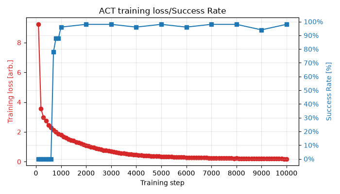
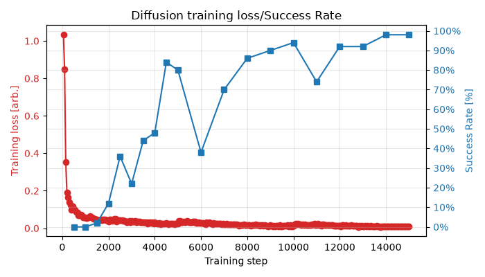
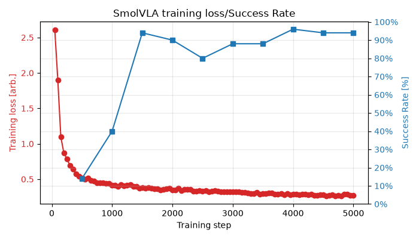

https://github.com/user-attachments/assets/23cd53e5-880b-4e80-b60b-f1bb0a08e3fa

# Robot Learning on LIBERO — Behavior Cloning
A controlled comparison of ACT, Diffusion Policy, and SmolVLA on a single manipulation task
## 1. Motivation
This mini-project compares three modern robot-learning policy families—ACT, Diffusion Policy, and SmolVLA—on the LIBERO-Goal task *put the bowl on the plate*. 
The goal is to gain practical experience in policy training/fine-tuning and closed-loop evaluation, and to study how training loss, task success, and failure modes evolve during training.

## 2. Experiment Setup
- **Framework**: LeRobot
- **Task**: *Put the bowl on the plate* in LIBERO-Goal
    - Observation: 2 x RGB cameras (256x256) + 8-D proprioceptive state
    - Action: 7-D relative action
    - Control Frequency: 20 Hz
- **Training**:
    - Training data: the same 49 demonstrations for all policies
    - Batch Size: 8
    - Hardware: RTX 5060 Laptop GPU, 8 GB
    - Model:
        - ACT: trained directly using the task demonstrations with a ResNet-18 vision backbone. 
        - Diffusion Policy: trained directly using the task demonstrations with a ResNet-18 vision backbone. 
        - SmolVLA: fine-tuned from a pretrained VLA with rank-8 LoRA using the task demonstrations.
- **Evaluation**:
    - Closed-loop success rate on the official 50-state LIBERO evaluation set
    - Max Rollout Length: 300 Steps
    - Stochastic policies were evaluated using fixed rollout seed to improve checkpoint-to-checkpoint comparability.
    

## 3. Learning Curves

A common observation across all three policies is that training loss decreases much more smoothly than closed-loop task success. 
This highlights the importance of simulator rollout evaluation rather than selecting robot policies from training loss alone. 

All three policies eventually achieve high success rates, although none reaches perfect performance.
In this experiment, ACT reaches high success rates after fewer training steps than Diffusion Policy, while SmolVLA also adapts rapidly. 
However, training-step counts are not directly comparable across models, particularly because SmolVLA benefits from pretrained weights and LoRA adaptation.

The evolution of task success also differs substantially across policies.
ACT exhibits a sharp transition between 500 and 1000 steps, rising from 0% to above 90%, followed by a plateau around 94-98%. 
Diffusion policy improves more gradually but shows considerably larger checkpoint-to-checkpoint variation; for example, the success rate reaches 84% at step 4500, falls to 38% at step 6000,and later reaches 94% at step 10000. 
SmolVLA improves rapidly between step 500 and 2000, followed by slower gains and apparent saturation around steps 4000-5000.  

## 4. Rollout / Failure Analysis
- **Failure Stage**:
    - reach: the robot does not approach the bowl closely enough to attempt a grasp.
    - grasp: the robot reaches toward object but fails to acquire it. 
    - transport: grasp succeeds, but the bowl is dropped or lost during transport.
    - release: the bowl reaches the plate, but the gripper does not release it correctly.  
    - placement: the bowl reaches the target region but is not placed in a configuration that satisfies the success criterion. 
    - timeout: the rollout does not clearly fall into one of the above failure stages but does not complete the task within 300 steps.
- **Recovery Behavior**: after initial mistake, the policy attemps a corrective action; recovery is recorded separately from the failure stage.

| Model | Checkpoint | Success Rate | Main Failures | Observation |
| :--- | :--- | :--- | :---: | :--- |
| ACT | 500 | 0% | 50 grasp | The model has learned to reach toward the bowl but not yet to grasp it successfully. |
| ACT | 800 | 88% | 5 grasp; 1 placement | The model has learned to complete the task in many cases. | 
| ACT | 10000 | 98% | 1 transport | The model has learned to complete the task in most cases. | 
| Diffusion | 500 | 0% | 50 reach | The model failed to learn to reach toward the bowl. |
| Diffusion | 10000 | 94% | 2 grasp; 1 transport | The model has learned to complete the task in most cases. |
| SmolVLA | 500 | 14% | 35 grasp; 6 transport; 2 placement | The model has learned to reach toward the bowl and to grasp the bowl successfully in 30% of the cases.|
| SmolVLA | 2000 | 90% | 1 grasp; 4 placement | A recovery attempt (attempt to re-grasp a misplaced bowl) is observed. |
| SmolVLA | 5000 | 94% | 1 grasp; 2 transport | No recovery attempt was observed. | 

## 5. Example Rollouts

### Successful rollout
https://github.com/user-attachments/assets/a2672ca1-9d8a-4260-978d-264eaa9112ea

### Grasp failure during early ACT training
https://github.com/user-attachments/assets/7b067683-f8bf-4ca2-a1c3-0f837e5979ae

### SmolVLA recovery attempt
https://github.com/user-attachments/assets/c5e3fec8-b842-4600-a434-aab7c0792005

## 6. Preliminary Findings and Open Questions
- Training loss is not a reliable predictor of closed-loop performance. Rollout evaluation is therefore necessary for checkpoint selection and policy assessment.
- Different manipulation capabilities emerge at different stages of training. ACT's sharp improvement in task success coincides with a substantial reduction in grasping failures, suggesting that reliable grasping may be an important early bottleneck. Later failures shift toward transport or placement.
- Residual failures remain even after success rates appear to saturate. Some policies also exhibit recovery attempts after an initial mistake, raising questions about how recovery behavior emerges and whether explicitly improving recovery could further increase robustness.
- Diffusion Policy shows noticeably larger checkpoint-to-checkpoint variation than ACT. Further experiments across training and rollout seeds would be needed to determine whether this primarily reflects optimization variability, stochastic inference, or both.

## 7. Limitations 
- Each checkpoint is evaluated on only 50 episodes. Small differences in success rate should therefore not be interpreted as statistically significant.
- Each model was trained only once. A rigorous comparison would require multiple training seeds and model-specific hyperparameter tuning.
- SmolVLA benefits from large-scale pretraining, whereas ACT and Diffusion Policy are trained directly from the task demonstrations; the results therefore should not be interpreted as a pure architecture comparison.

## 8. Next Experiments
- Extend the comparison to multi-task learning.
- Investigate robustness, recovery behavior, and remaining failure modes.

